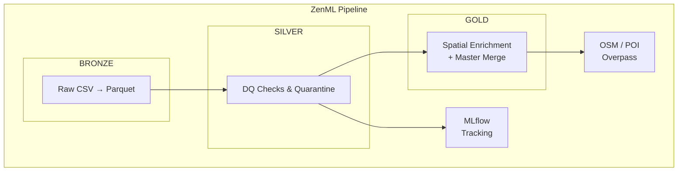

# 🌀 DataStorm v7

**An end-to-end MLOps data pipeline for beverage distribution analytics in Sri Lanka.**

Built for the [DataStorm 7.0](https://octave.lk/datastorm/) competition, this project implements a production-grade **Medallion Architecture** (Bronze → Silver → Gold) orchestrated by [ZenML](https://zenml.io), with experiment tracking via [MLflow](https://mlflow.org/) and data versioning through [DVC](https://dvc.org/).

---

## 📋 Table of Contents

- [Overview](#overview)
- [Architecture](#architecture)
- [Project Structure](#project-structure)
- [Pipeline Stages](#pipeline-stages)
- [Getting Started](#getting-started)
- [Configuration](#configuration)
- [Tech Stack](#tech-stack)
- [License](#license)

---

## Overview

DataStorm v7 ingests raw transactional and geospatial data from Sri Lanka's FMCG distribution network, cleans and validates it through automated data-quality gates, enriches outlet profiles with OpenStreetMap point-of-interest (POI) features, and produces a unified **master training matrix** ready for downstream ML modeling.

### Key Highlights

| Capability | Detail |
|---|---|
| **Data Ingestion** | Batch CSV → Parquet conversion for 5 source tables |
| **Data Quality** | Automated null checks, range validation, and quarantine of rejected rows |
| **Spatial Enrichment** | Vectorized spatial joins with 1 km POI buffers using GeoPandas |
| **Experiment Tracking** | DQ metrics logged to MLflow (clean ratio, row counts) |
| **Orchestration** | Fully reproducible ZenML pipeline with step-level caching |
| **Data Versioning** | DVC-tracked data artifacts |

---

## Architecture



---

## Project Structure

```
DataStorm-v7/
├── README.md
└── datastorm-v7/                  # Main project root (ZenML project)
    ├── params.yaml                # Central pipeline configuration
    ├── prime_map_data.py          # Standalone script to pre-download POIs
    ├── mlflow.db                  # MLflow experiment tracking database
    │
    ├── pipeline/                  # Pipeline step definitions
    │   ├── datastorm_pipeline.py  # 🔗 Main pipeline orchestrator
    │   ├── bronze_ingestion.py    # Step 1 — CSV → Parquet ingestion
    │   ├── silver_cleaning.py     # Step 2 — DQ checks & cleaning
    │   ├── dq_checks.py          # Reusable data quality utilities
    │   └── gold_merger.py        # Step 4 — Master feature matrix merge
    │
    ├── scraping/                  # External data acquisition
    │   ├── poi_processor.py       # Step 3 — OSM POI download & spatial joins
    │   └── sri_lanka_pois.parquet # Cached POI dataset
    │
    ├── modeling/                  # ML model development (WIP)
    │
    ├── raw_data/                  # Source CSV files (gitignored)
    │   ├── transactions_history_final.csv
    │   ├── outlet_master.csv
    │   ├── outlet_coordinates.csv
    │   ├── distributor_seasonality_details.csv
    │   └── holiday_list.csv
    │
    ├── data/                      # Medallion data lake
    │   ├── bronze/                # Ingested parquet files
    │   ├── silver/                # Cleaned data + rejected/ quarantine
    │   └── gold/                  # Final feature matrix
    │
    └── outputs/                   # Pipeline run outputs
```

---

## Pipeline Stages

### 1️⃣ Bronze — Ingestion (`bronze_ingestion.py`)

Reads all raw CSV source files and converts them to Parquet format in the `data/bronze/` layer for efficient downstream processing.

**Sources ingested:**

- `transactions_history_final.csv` — Historical outlet transaction volumes
- `outlet_master.csv` — Outlet metadata and attributes
- `outlet_coordinates.csv` — Outlet latitude/longitude
- `distributor_seasonality_details.csv` — Distributor seasonal patterns
- `holiday_list.csv` — Sri Lankan holiday calendar

### 2️⃣ Silver — Cleaning & DQ (`silver_cleaning.py`)

Applies automated data quality checks and quarantines failing records:

- **Null validation** on mandatory fields (`Outlet_ID`, `Volume_Liters`)
- **Range validation** — removes negative volume entries
- **Quarantine pattern** — rejected rows are saved to `data/silver/rejected/` with tagged failure reasons for auditability
- **MLflow logging** — tracks `dq_total_raw_rows`, `dq_clean_rows`, and `dq_clean_ratio`

### 3️⃣ Gold — Spatial Enrichment (`poi_processor.py`)

Enriches outlet profiles with nearby point-of-interest counts from OpenStreetMap:

- Downloads Sri Lanka POIs via the Overpass API (schools, hospitals, bus stations, restaurants, hotels, shops, etc.)
- Projects coordinates to **UTM Zone 44N** (EPSG:32644) for metric distance calculations
- Creates **1 km buffer zones** around each outlet
- Performs vectorized spatial joins using GeoPandas
- Produces per-outlet POI type counts (e.g., `poi_school_count`, `poi_hospital_count`)

### 4️⃣ Gold — Master Merge (`gold_merger.py`)

Forges the final training-ready feature matrix by joining:

- Cleaned transaction aggregates (total volume, avg transaction size, count)
- Outlet master attributes
- Spatial POI features

Applies smart imputation (numeric → 0, categorical → "Unknown") and saves as `data/gold/master_training_data.parquet`.

---

## Getting Started

### Prerequisites

- Python 3.9+
- [ZenML](https://docs.zenml.io/getting-started/installation)
- [DVC](https://dvc.org/doc/install)

### Installation

```bash
# Clone the repository
git clone https://github.com/sukitha2001/datastorm-v7.git
cd datastorm-v7/datastorm-v7

# Install dependencies
pip install zenml pandas geopandas shapely requests mlflow pyarrow pyyaml

# Initialize ZenML
zenml init

# Register the MLflow experiment tracker
zenml experiment-tracker register mlflow_tracker --flavor=mlflow
zenml stack update default -e mlflow_tracker
```

### Prepare Data

Place the competition CSV files in the `raw_data/` directory:

```
raw_data/
├── transactions_history_final.csv
├── outlet_master.csv
├── outlet_coordinates.csv
├── distributor_seasonality_details.csv
└── holiday_list.csv
```

### Pre-download POI Data (Optional)

To avoid Overpass API timeouts during pipeline runs, pre-cache the POI dataset:

```bash
python prime_map_data.py
```

### Run the Pipeline

```bash
python pipeline/datastorm_pipeline.py
```

The pipeline will execute all four stages sequentially and produce the final feature matrix at `data/gold/master_training_data.parquet`.

---

## Configuration

All pipeline parameters are centralized in **`params.yaml`**:

```yaml
data:
  raw_dir: "raw_data"
  bronze_dir: "data/bronze"
  silver_dir: "data/silver"
  gold_dir: "data/gold"

cleaning:
  max_volume_liters: 50000
  min_volume_liters: 0

modeling:
  quantile_alpha: 0.90
  random_state: 42
```

| Parameter | Description |
|---|---|
| `data.*_dir` | I/O paths for each Medallion layer |
| `cleaning.min_volume_liters` | Lower bound for volume validation (rows below this are quarantined) |
| `cleaning.max_volume_liters` | Upper bound for volume validation |
| `modeling.quantile_alpha` | Quantile threshold for downstream modeling |
| `modeling.random_state` | Reproducibility seed |

---

## Tech Stack

| Tool | Purpose |
|---|---|
| **ZenML** | Pipeline orchestration, step caching, artifact tracking |
| **MLflow** | Experiment tracking and DQ metric logging |
| **DVC** | Data versioning for large Parquet artifacts |
| **Pandas** | Tabular data manipulation |
| **GeoPandas** | Geospatial operations and spatial joins |
| **Shapely** | Geometric computations (buffering, points) |
| **PyArrow / Parquet** | Columnar storage format for all data layers |
| **Overpass API** | OpenStreetMap POI data acquisition |

---

## License

This project was developed for the DataStorm 7.0 competition organized by the Octave — John Keells Group.
